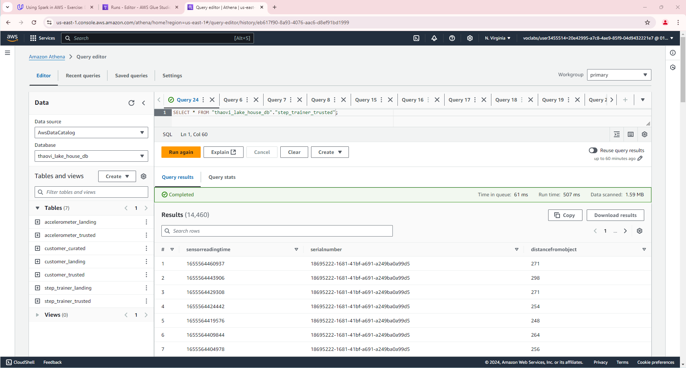

# STEDI Human Balance Analysis Project

## Overview

In this project, you'll act as a data engineer for the STEDI team to build a data lakehouse solution for sensor data that trains a machine learning model.
The STEDI Team has been hard at work developing a hardware STEDI Step Trainer that:
1. Trains the user to do a STEDI balance exercise;
2. And has sensors on the device that collect data to train a machine-learning algorithm to detect steps;
3. Has a companion mobile app that collects customer data and interacts with the device sensors.

STEDI has heard from millions of early adopters who are willing to purchase the STEDI Step Trainers and use them.
Several customers have already received their Step Trainers, installed the mobile application, and begun using them together to test their balance. The Step Trainer is just a motion sensor that records the distance of the object detected. The app uses a mobile phone accelerometer to detect motion in the X, Y, and Z directions.

The STEDI team wants to use the motion sensor data to train a machine learning model to detect steps accurately in real-time. Privacy will be a primary consideration in deciding what data can be used.

Some of the early adopters have agreed to share their data for research purposes. Only these customers’ Step Trainer and accelerometer data should be used in the training data for the machine learning model.

As a data engineer on the STEDI Step Trainer team, you'll need to extract the data produced by the STEDI Step Trainer sensors and the mobile app, and curate them into a data lakehouse solution on AWS so that Data Scientists can train the learning model.

## Project Environment
- Python and Spark
- AWS Glue
- AWS Athena
- AWS S3

## Project Data
STEDI has three JSON data sources(opens in a new tab) to use from the Step Trainer. Check out the JSON data in the following folders in the Github repo:
1. Customer Records        
2. Step Trainer Records
3. Accelerometer Records

## Project Step

<b><u>Step 1: Create a S3 Bucket For Yourself</u></b> 
####
        aws s3 mb s3://[your-bucket-name]

<b><u>Step 2: Create S3 Gateway Endpoint</u></b> 
####
        aws ec2 create-vpc-endpoint --vpc-id [your-vpd-id] --service-name com.amazonaws.us-east-1.s3 --route-table-ids [your-route-table-ids]

<b><u>Step 3: Create a IAM Glue Service Role</u></b> 
1. Create the Glue Service Role
2. Grant Glue Privileges on the S3 Bucket
3. Grant Glue Policy on the S3 Bucket
Detail to this step have refer my setup in `aws_setup_glue_service_role.md` file

<b><u>Step 4: Copy project data to S3 bucket folder</u></b>
In this step, we'll need to create our own S3 directories for the customer/landing, step_trainer/landing, and accelerometer/landing zones, and then copy the data into these directories as a starting point. S3 bucket name is the bucket created in Step1.

<b><u>Step 5: Create starter database and table for 3 landing zone</u></b>
- Create your database and 3 tables 'customer_landing', 'accelerometer_landing' and 'step_trainer_landing' in Data Catalog in AWS Glue
- Go to AWS Athena try to query the data in these tables.

<b><u>Step 6: Initial Analysis</u></b>
The Data Science team has done some preliminary data analysis and determined that the Accelerometer Records each match one of the Customer Records. They would like you to create 2 AWS Glue Jobs that do the following:
- Sanitize the Customer data from the Website (Landing Zone) and only store the Customer Records who agreed to share their data for research purposes (Trusted Zone) - creating a Glue Table called customer_trusted. At this step need to run this script in AWS Glue Job: `customer_landing_to_trusted.py`
- Sanitize the Accelerometer data from the Mobile App (Landing Zone) - and only store Accelerometer Readings from customers who agreed to share their data for research purposes (Trusted Zone) - creating a Glue Table called accelerometer_trusted. t this step need to run this script in AWS Glue Job: `accelerometer_landing_to_trusted.py`

<b><u>Step 7: Training Data</u></b> 

Data Scientists have discovered a data quality issue with the Customer Data. The serial number should be a unique identifier for the STEDI Step Trainer they purchased. However, there was a defect in the fulfillment website, and it used the same 30 serial numbers over and over again for millions of customers! Most customers have not received their Step Trainers yet, but those who have, are submitting Step Trainer data over the IoT network (Landing Zone). The data from the Step Trainer Records has the correct serial numbers.

The problem is that because of this serial number bug in the fulfillment data (Landing Zone), we don’t know which customer the Step Trainer Records data belongs to.

The Data Science team would like you to write a Glue job that does the following:

- Sanitize the Customer data (Trusted Zone) and create a Glue Table (Curated Zone) that only includes customers who have accelerometer data and have agreed to share their data for research called customers_curated: Run glue job with script`customer_trusted_to_curated.py`
- Read the Step Trainer IoT data stream (S3) and populate a Trusted Zone Glue Table called step_trainer_trusted that contains the Step Trainer Records data for customers who have accelerometer data and have agreed to share their data for research (customers_curated): Run glue job with script`step_trainer_landing_to_trusted.py`
- Create an aggregated table that has each of the Step Trainer Readings, and the associated accelerometer reading data for the same timestamp, but only for customers who have agreed to share their data, and make a glue table called machine_learning_curated:Run glue job with script`machine_learning_trusted_to_curated.py`

## Athena SQL Query To Verify Result from AWS Glue Job
After each stage of your project, check if the row count in the produced table is correct. You should have the following number of rows in each table:
1. Landing
        Customer: 956
        
        Accelerometer: 81273
        
        Step Trainer: 28680
        
2. Trusted
        Customer: 482
        
        Accelerometer: 40981
        
        Step Trainer: 14460
        
2. Curated
        Customer: 482
        
        Machine Learning: 43681
        